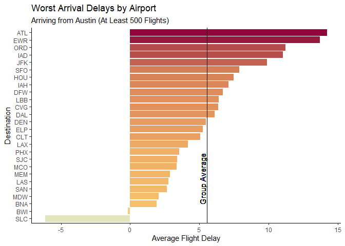
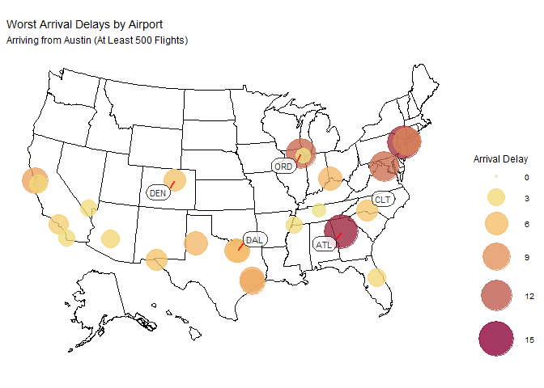

## Problem 1

### Am I actually always late for my connecting flight?

I have taken several flights out of Austin-Bergstrom International
Airport. Because there are no direct flights from Austin to Madison, WI,
I have to use connecting flights. This prompts the question: why does it
always feel like I’m late arriving to my connecting flight?

First, let’s look at the average arrival delay by airport. This dataset
includes any destination airport with more than 500 flights from ABIA in
2008 (n=26).

Congratulations to Salt Lake City for being early on average! Most
airports, however, are late on average (around 5.5 minutes). What does
this mean for my connecting flights? According to Business Wire, the
major transfer hubs in the US are Dallas/Fort Worth (a major hub for
American Airlines), Charlotte (also American), Atlanta (Delta),
Chicago-O’Hare (United), and Denver (Frontier). It turns out, if you
have to take a connecting flight, Charlotte (CLT) is your best bet,
while Denver (DEN) and Dallas (DAL) perform about average for this
group, at 5 minutes average arrival delay. Unfortunately for me and many
other travellers, the major hubs in Atlanta (ATL) and Chicago (ORD) are
in for some of the worst delays in the country for any flight out of
Austin.

