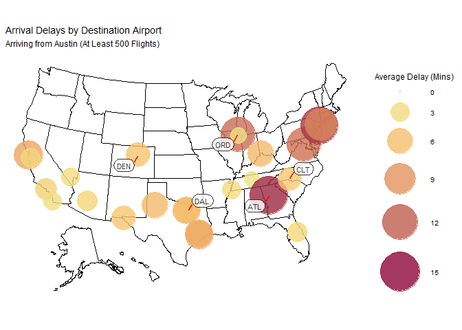

## Including Plots

You can also embed plots, for example:

    ## -- Attaching packages --------------------------------------- tidyverse 1.3.1 --

    ## v ggplot2 3.3.5     v purrr   0.3.4
    ## v tibble  3.1.6     v dplyr   1.0.7
    ## v tidyr   1.1.4     v stringr 1.4.0
    ## v readr   2.1.1     v forcats 0.5.1

    ## -- Conflicts ------------------------------------------ tidyverse_conflicts() --
    ## x dplyr::filter() masks stats::filter()
    ## x dplyr::lag()    masks stats::lag()

    ## Registered S3 method overwritten by 'mosaic':
    ##   method                           from   
    ##   fortify.SpatialPolygonsDataFrame ggplot2

    ## 
    ## The 'mosaic' package masks several functions from core packages in order to add 
    ## additional features.  The original behavior of these functions should not be affected by this.

    ## 
    ## Attaching package: 'mosaic'

    ## The following object is masked from 'package:Matrix':
    ## 
    ##     mean

    ## The following objects are masked from 'package:dplyr':
    ## 
    ##     count, do, tally

    ## The following object is masked from 'package:purrr':
    ## 
    ##     cross

    ## The following object is masked from 'package:ggplot2':
    ## 
    ##     stat

    ## The following objects are masked from 'package:stats':
    ## 
    ##     binom.test, cor, cor.test, cov, fivenum, IQR, median, prop.test,
    ##     quantile, sd, t.test, var

    ## The following objects are masked from 'package:base':
    ## 
    ##     max, mean, min, prod, range, sample, sum

    ## Loading required package: sp

    ## Checking rgeos availability: FALSE
    ## Please note that 'maptools' will be retired by the end of 2023,
    ## plan transition at your earliest convenience;
    ## some functionality will be moved to 'sp'.
    ##      Note: when rgeos is not available, polygon geometry     computations in maptools depend on gpclib,
    ##      which has a restricted licence. It is disabled by default;
    ##      to enable gpclib, type gpclibPermit()

    ## Please note that rgdal will be retired by the end of 2023,
    ## plan transition to sf/stars/terra functions using GDAL and PROJ
    ## at your earliest convenience.
    ## 
    ## rgdal: version: 1.5-28, (SVN revision 1158)
    ## Geospatial Data Abstraction Library extensions to R successfully loaded
    ## Loaded GDAL runtime: GDAL 3.2.1, released 2020/12/29
    ## Path to GDAL shared files: C:/Users/bjwil/OneDrive/Documents/R/win-library/4.1/rgdal/gdal
    ## GDAL binary built with GEOS: TRUE 
    ## Loaded PROJ runtime: Rel. 7.2.1, January 1st, 2021, [PJ_VERSION: 721]
    ## Path to PROJ shared files: C:/Users/bjwil/OneDrive/Documents/R/win-library/4.1/rgdal/proj
    ## PROJ CDN enabled: FALSE
    ## Linking to sp version:1.4-6
    ## To mute warnings of possible GDAL/OSR exportToProj4() degradation,
    ## use options("rgdal_show_exportToProj4_warnings"="none") before loading sp or rgdal.
    ## Overwritten PROJ_LIB was C:/Users/bjwil/OneDrive/Documents/R/win-library/4.1/rgdal/proj

    ## 
    ## Attaching package: 'rgdal'

    ## The following object is masked from 'package:mosaic':
    ## 
    ##     project

    ## Loading required package: viridisLite

    ## here() starts at C:/Users/bjwil/OneDrive/Documents/GitHub/DataMining

## Including Plots

You can also embed plots, for example:

    ## `summarise()` has grouped output by 'Longitude', 'Latitude'. You can override using the `.groups` argument.

    ## Warning in showSRID(uprojargs, format = "PROJ", multiline = "NO", prefer_proj =
    ## prefer_proj): Discarded datum unknown in Proj4 definition

Note that the `echo = FALSE` parameter was added to the code chunk to
prevent printing of the R code that generated the plot.
