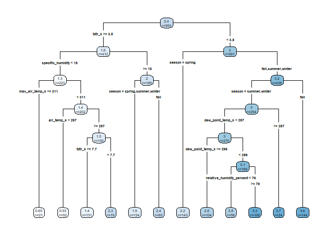
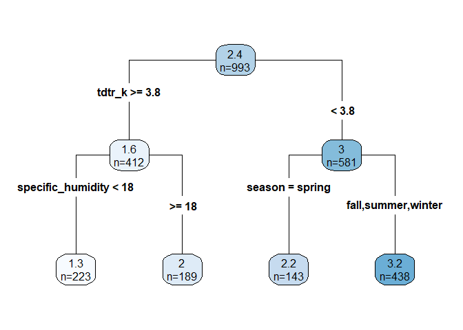
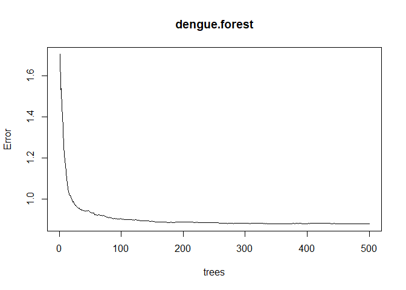
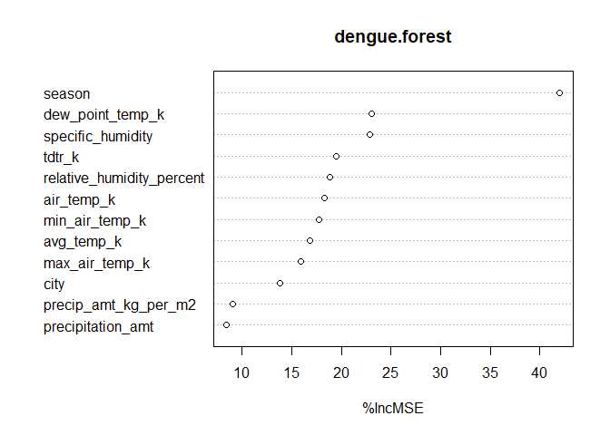
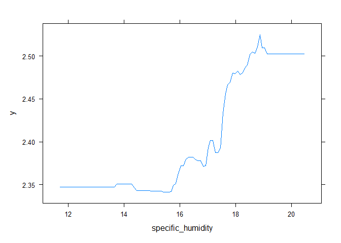
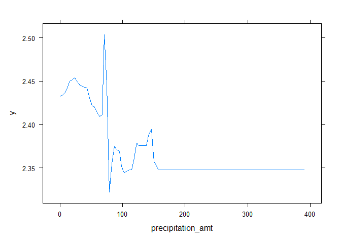
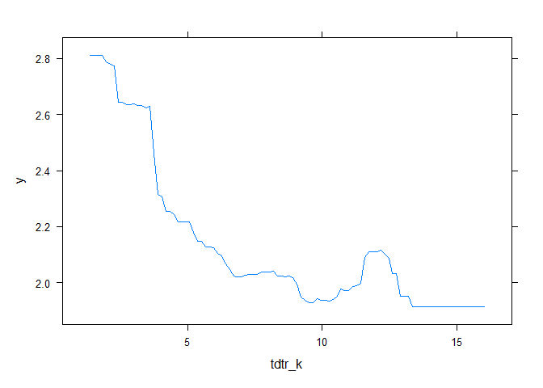

# Homework 3

## Problem 1

1.  The problem with a simple regression of “crime” on “police” is that
    crime is endogenous in police. That is, more crime might directly
    cause more police (a particularly high crime area gets more police,
    instead of the reverse, undermining any element of causality).
    Therefore, we can’t so easily identify the effect of policing on
    crime.
2.  The researchers used a unique element of Washington, DC, where extra
    police are mandated by the national “terror alert” system. On high
    alert days, more police are automatically put on the street.
    Therefore, police presence is not a function of “street” crime and
    is entirely determined exogenously. The results indicate that extra
    police presence as a result of high alert is associated with a
    decrease in crime when police presence is determined by something
    other than the local crime level. This is useful evidence in the
    case for the deterrent effect of police on crime.
3.  Ridership controls for a decrease in crime caused by fewer people
    (fewer tourists on a given day, for example) in the area because
    they are concerned about a high terrorism alert. In other words,
    this provides a check on the hypothesis that the decrease in crime
    is related to the increased police presence, and not a decrease in
    civilian and criminal activity directly related to concerns about
    terrorism itself.
4.  This model appears to be modeling the interaction between the high
    alert variable and the various police districts of DC, while
    controlling for metro ridership. The results indicate that midday
    ridership is associated with an increase in crime, and that high
    alert status in the first police district is associated with a
    decrease in crime. However, this effect seems to lessen or disappear
    in the other districts (not district 1), and the coefficient on the
    interaction variable in any other district is not statistically
    distinguishable from zero. It is likely this was included because it
    allows the researchers to look where police concentration is largest
    (the first district) while holding other confounders constant (such
    as weather, unrelated changes in tourism, etc.) that should effect
    the districts similarly.

## Problem 2

Our model will consider a prediction of log cases of dengue using CART,
random forest, and boosted trees. Our model will consider `city`,
`season`, `precipitation_amt`, `avg_temp_k`, `air_temp_k`,
`dew_point_temp_k`, `max_air_temp_k`,`min_air_temp_k`,
`precip_amt_kg_per_m2`, `relative_humidity_percent`,
`specific_humidity`, and `tdtr_k` as features.

Let’s begin by taking a look at our CART.

We are already starting to lose some interpretability. What if we use
the 1SE rule to prune the tree back?

Much more parsimonious. Our first split comes from Average Diurnal
Temperature Range (DTR), and then our splits come from season and
specific humidity.

Let’s consider a random forest instead. Here you can see MSE as a
function of the number of trees used in the random forest. It levels out
before reaching 100 trees, so we aren’t gaining that much after that.

Let’s compare RMSEs to see how we are doing. The pruned tree has an RMSE
of .9372, while the random forest has an RMSE of .8767, a marked
improvement (recall that our predictions are in log form).

What about variable importance? Is there anything that could be ignored
from the random forest without noticeable improvement?

Precipitation amount has the lowest variable importance, probably
because it is partially captured by precipitation per square meter, but
it is also not irrelevant.

Finally, let’s consider a gradient boosted tree. To compare different
the different tuning parameters, we create a for-loop that runs through
a number of interaction depth, shrinkage, and number of tree variables.
Seeing the lowest RMSE value allows us to set the parameters as optimal.

    hyper_grid %>%
      dplyr::arrange(min_RMSE) %>%
      head(10)

    ##    shrinkage interaction.depth optimal_trees  min_RMSE
    ## 1      0.010                 4           460 0.9576874
    ## 2      0.010                 5           411 0.9598106
    ## 3      0.010                 3           438 0.9611258
    ## 4      0.008                 4           465 0.9611482
    ## 5      0.003                 5          1159 0.9612847
    ## 6      0.003                 4          1344 0.9612945
    ## 7      0.008                 5           462 0.9613949
    ## 8      0.005                 4           693 0.9614216
    ## 9      0.001                 4          4928 0.9615875
    ## 10     0.005                 5           693 0.9619146

\`\`\`

Let’s set the shrinkage to .01 and the interaction depth to 4. Trees
will be set to 500 since it converged around the mid-400s.

Comparing RMSEs, the random forest does just slightly better than the
boosted model.

<table>
<thead>
<tr class="header">
<th>Model</th>
<th>RMSE</th>
</tr>
</thead>
<tbody>
<tr class="odd">
<td>CART</td>
<td>‘r x’</td>
</tr>
<tr class="even">
<td>Forest</td>
<td>‘r y’</td>
</tr>
<tr class="odd">
<td>Boosted</td>
<td>‘r z’</td>
</tr>
</tbody>
</table>

Let’s look at partial dependence plots from the boosted tree. We include
`specific_humidity` and `precipitation_amt`, as well as `tdtr_k` since
it played an important role in the first tree we looked at.

