# Homework 1

Patrick Massey, Harrison Snell, Brandon Williams

## Problem 1

### Am I actually always late for my connecting flight?

I have taken several flights out of Austin-Bergstrom International
Airport. Because there are no direct flights from Austin to Madison, WI,
I have to use connecting flights. This prompts the question: why does it
always feel like I’m late arriving to my connecting flight?

First, let’s look at the average arrival delay by airport. This dataset
includes any destination airport with more than 500 flights from ABIA in
2008 (n=26).

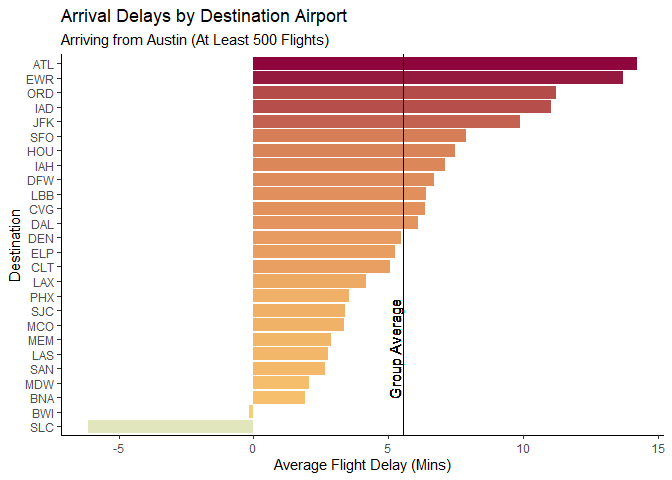

Congratulations to Salt Lake City for being early on average! Most
airports, however, are late on average (around 5.5 minutes). What does
this mean for my connecting flights? According to Business Wire, the
major transfer hubs in the US are Dallas/Fort Worth (a major hub for
American Airlines), Charlotte (also American), Atlanta (Delta),
Chicago-O’Hare (United), and Denver (Frontier). It turns out, if you
have to take a connecting flight, Charlotte (CLT) is your best bet,
while Denver (DEN) and Dallas (DAL) perform about average for this
group, at 5 minutes average arrival delay. Unfortunately for me and many
other travellers, the major hubs in Atlanta (ATL) and Chicago (ORD) are
in for some of the worst delays in the country for any flight out of
Austin.

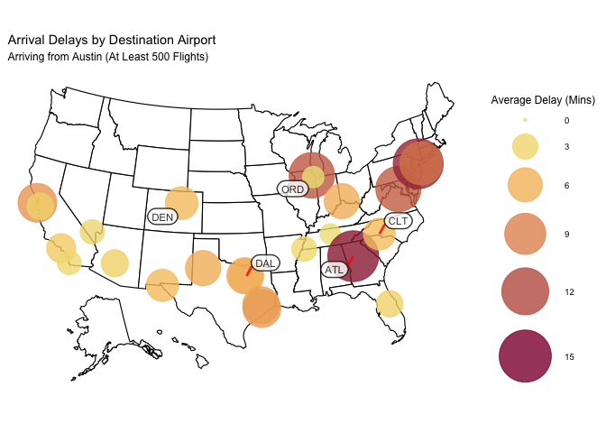

## Problem 2

Part a:

<table>
<thead>
<tr class="header">
<th style="text-align: left;">performer</th>
<th style="text-align: left;">song</th>
<th style="text-align: right;">count</th>
</tr>
</thead>
<tbody>
<tr class="odd">
<td style="text-align: left;">Imagine Dragons</td>
<td style="text-align: left;">Radioactive</td>
<td style="text-align: right;">87</td>
</tr>
<tr class="even">
<td style="text-align: left;">AWOLNATION</td>
<td style="text-align: left;">Sail</td>
<td style="text-align: right;">79</td>
</tr>
<tr class="odd">
<td style="text-align: left;">Jason Mraz</td>
<td style="text-align: left;">I’m Yours</td>
<td style="text-align: right;">76</td>
</tr>
<tr class="even">
<td style="text-align: left;">The Weeknd</td>
<td style="text-align: left;">Blinding Lights</td>
<td style="text-align: right;">76</td>
</tr>
<tr class="odd">
<td style="text-align: left;">LeAnn Rimes</td>
<td style="text-align: left;">How Do I Live</td>
<td style="text-align: right;">69</td>
</tr>
<tr class="even">
<td style="text-align: left;">LMFAO Featuring Lauren Bennett &amp; GoonRock</td>
<td style="text-align: left;">Party Rock Anthem</td>
<td style="text-align: right;">68</td>
</tr>
<tr class="odd">
<td style="text-align: left;">OneRepublic</td>
<td style="text-align: left;">Counting Stars</td>
<td style="text-align: right;">68</td>
</tr>
<tr class="even">
<td style="text-align: left;">Adele</td>
<td style="text-align: left;">Rolling In The Deep</td>
<td style="text-align: right;">65</td>
</tr>
<tr class="odd">
<td style="text-align: left;">Jewel</td>
<td style="text-align: left;">Foolish Games/You Were Meant For Me</td>
<td style="text-align: right;">65</td>
</tr>
<tr class="even">
<td style="text-align: left;">Carrie Underwood</td>
<td style="text-align: left;">Before He Cheats</td>
<td style="text-align: right;">64</td>
</tr>
</tbody>
</table>

Part b:

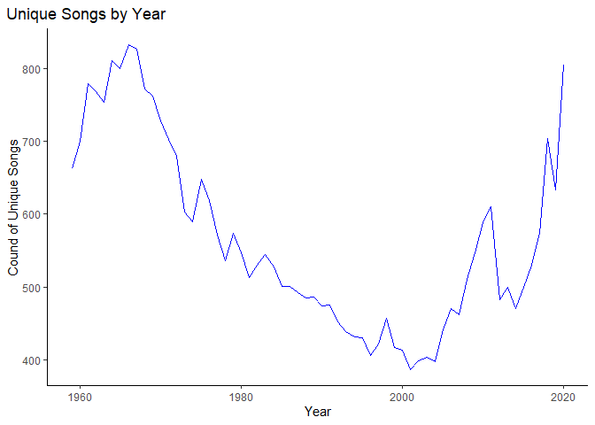

Part c:

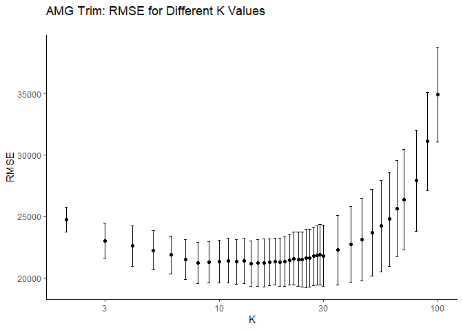

## Problem 3

Part a:

The 95th percentile of height for female competitors in the Athletics
events is: 183

Part b:

The event with the highest standard deviation is: Rowing Women’s Coxed
Fours which had a standard deviation of 10.87.

Part c:

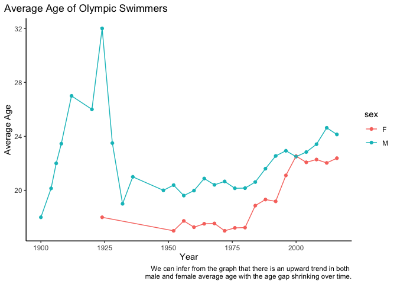

Prior to the 1952 Olympic Games, there appears to be a small number of
participants for each year which is causing the large swings early on.
After 1952 the amount of participating athletes becomes larger and
stabilizes the mean of the age of the participants.

## Problem 4

In this problem, we want to find the optimal value of K in our KNN
regressions for each trim. We began our approach by checking different K
values for each trim and plotting them based on the RMSE as shown below.
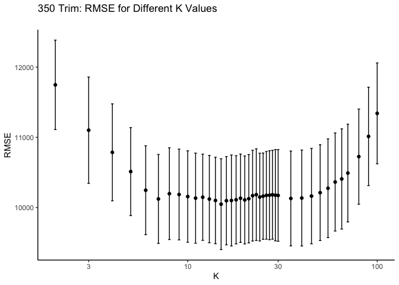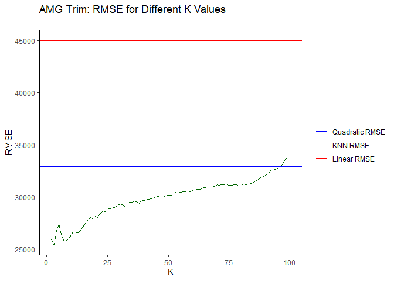

From these plots it is possible to determine a value of K that yields
the minimum RMSE. However, checking over different splits of the
train-test set, we can end up with varied values of K. Furthermore, it
is not clear that the optimal value of K corresponds to the minimum
value of K, because splits result in a very small K, which may not be
the optimal though it has the minimum RMSE. Thus, we utilize
cross-validation to find an optimal K.

We take the cross validation approach using 5 folds. In the chart of
RMSE versus K for each trim there is an average RMSE mapped with one
standard error bar. In each case, we use the “1SE” rule to determine our
optimal K. That is we chose the largest K value that was within one
standard error of the lowest average RMSE observed. Doing this with the
350 trims yields the following results.

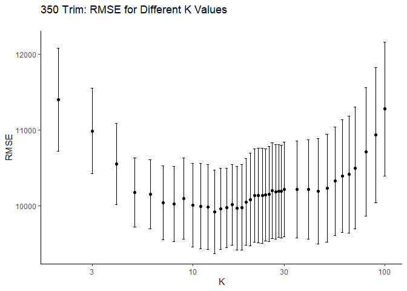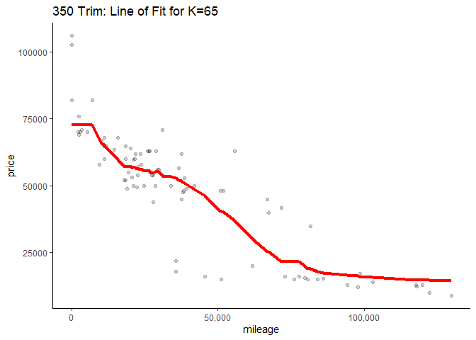

From the 350 Trim chart of RMSE versus K, we see that the optimal K is
65, as such we fit the KNN model with k=65 to the test data as shown
above.

Similarly, we can find an optimal K value for the AMG trim cars.

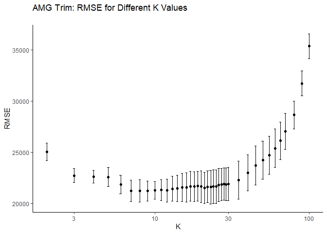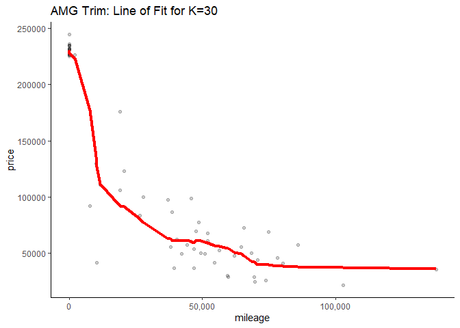

We see that the 1SE approach yields an optimal k=30. We observe higher
optimal K values for the 350 trim as compared to the AMG. This is due to
the fact that the number of observations for the AMG trim is much lower
than that of the 350. Thus to earn a lower RMSE, we need a more flexible
model, inducing a lower optimal K. Having a lower K will mean that the
values in our neighborhood are closer to the original point, which
yields a better result for the AMG trim, as the lack of observations
implies that a large neighborhood could capture far away points.
