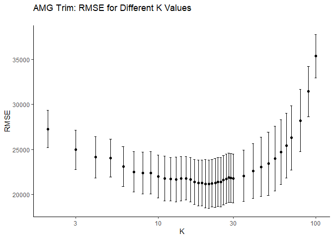
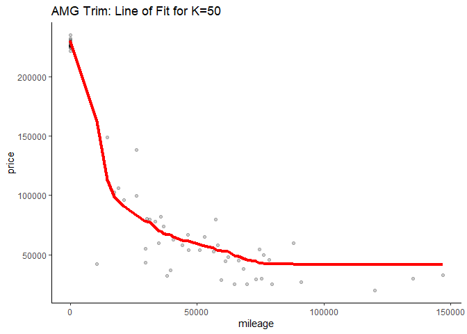

Problem 4
---------

In this problem, we want to find the optimal value of K in our KNN
regressions for each trim. We take the cross validation approach using 5
folds. In the chart of RMSE versus K for each trim there is an average
RMSE mapped with one standard error bar. In each case, we use the “1SE”
rule to determine our optimal K. That is we chose the largest K value
that was within one standard error of the lowest average RMSE observed.
Doing this with the 350 trims yields the following results.

From the 350 Trim chart of RMSE versus K, we see that the optimal K is
70, as such we fit the KNN model with k=70 to the test data as shown
above.

Similarly, we can find an optimal K value for the AMG trim cars.

We see that the 1SE approach yields an optimal k=55. We observe higher
optimal K values for the 350 trim as compared to the AMG. This is due to
the fact that the number of observations for the AMG trim is much lower
than that of the 350. Thus to earn a lower RMSE, we need a more flexible
model, inducing a lower optimal K. Having a lower K will mean that the
values in our neighborhood are closer to the original point, which
yields a better result for the AMG trim, as the lack of observations
implies that a large neighborhood could capture far away points.
