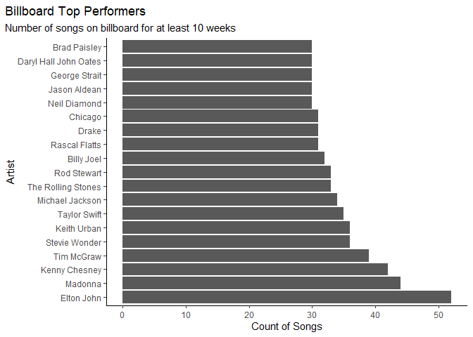
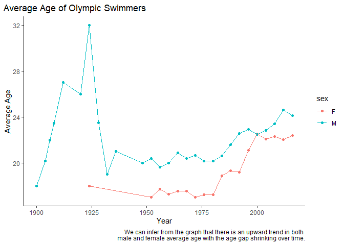
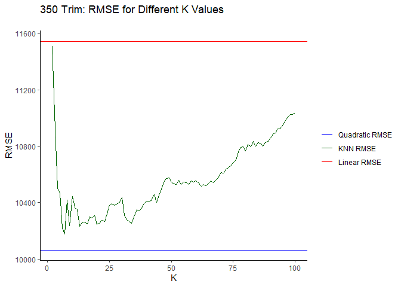

## Problem 1

### Am I actually always late for my connecting flight?

I have taken several flights out of Austin-Bergstrom International
Airport. Because there are no direct flights from Austin to Madison, WI,
I have to use connecting flights. This prompts the question: why does it
always feel like I’m late arriving to my connecting flight?

First, let’s look at the average arrival delay by airport. This dataset
includes any destination airport with more than 500 flights from ABIA in
2008 (n=26).

Congratulations to Salt Lake City for being early on average! Most
airports, however, are late on average (around 5.5 minutes). What does
this mean for my connecting flights? According to Business Wire, the
major transfer hubs in the US are Dallas/Fort Worth (a major hub for
American Airlines), Charlotte (also American), Atlanta (Delta),
Chicago-O’Hare (United), and Denver (Frontier). It turns out, if you
have to take a connecting flight, Charlotte (CLT) is your best bet,
while Denver (DEN) and Dallas (DAL) perform about average for this
group, at 5 minutes average arrival delay. Unfortunately for me and many
other travellers, the major hubs in Atlanta (ATL) and Chicago (ORD) are
in for some of the worst delays in the country for any flight out of
Austin.

 \#\#
Problem 2 (a)

    ## # A tibble: 10 × 3
    ## # Groups:   performer [10]
    ##    performer                                 song                          count
    ##    <chr>                                     <chr>                         <int>
    ##  1 Imagine Dragons                           Radioactive                      87
    ##  2 AWOLNATION                                Sail                             79
    ##  3 Jason Mraz                                I'm Yours                        76
    ##  4 The Weeknd                                Blinding Lights                  76
    ##  5 LeAnn Rimes                               How Do I Live                    69
    ##  6 LMFAO Featuring Lauren Bennett & GoonRock Party Rock Anthem                68
    ##  7 OneRepublic                               Counting Stars                   68
    ##  8 Adele                                     Rolling In The Deep              65
    ##  9 Jewel                                     Foolish Games/You Were Meant…    65
    ## 10 Carrie Underwood                          Before He Cheats                 64

(b) 
(c) 
\#\#Problem 3 \#a

The 95th percentile of height for female competitors in the Athletics
events is: 183 \#b

The event with the highest standard deviation is: Rowing Women’s Coxed
Fours which had a standard deviation of 10.87. \#c
 Prior
to the 1952 Olympic Games, there appears to be a small number of
participants for each year which is causing the large swings early on.
After 1952 the amount of participating athletes becomes larger and
stabilizes the mean of the age of the participants. \#\# Problem 4

In this problem, we want to find the optimal value of K in our KNN
regressions for each trim. We take the cross validation approach using 5
folds. In the chart of RMSE versus K for each trim there is an average
RMSE mapped with one standard error bar. In each case, we use the “1SE”
rule to determine our optimal K. That is we chose the largest K value
that was within one standard error of the lowest average RMSE observed.
Doing this with the 350 trims yields the following results.

From the 350 Trim chart of RMSE versus K, we see that the optimal K is
70, as such we fit the KNN model with k=70 to the test data as shown
above.

Similarly, we can find an optimal K value for the AMG trim cars.

We see that the 1SE approach yields an optimal k=40. We observe higher
optimal K values for the 350 trim as compared to the AMG. This is due to
the fact that the number of observations for the AMG trim is much lower
than that of the 350. Thus to earn a lower RMSE, we need a more flexible
model, inducing a lower optimal K. Having a lower K will mean that the
values in our neighborhood are closer to the original point, which
yields a better result for the AMG trim, as the lack of observations
implies that a large neighborhood could capture far away points.
