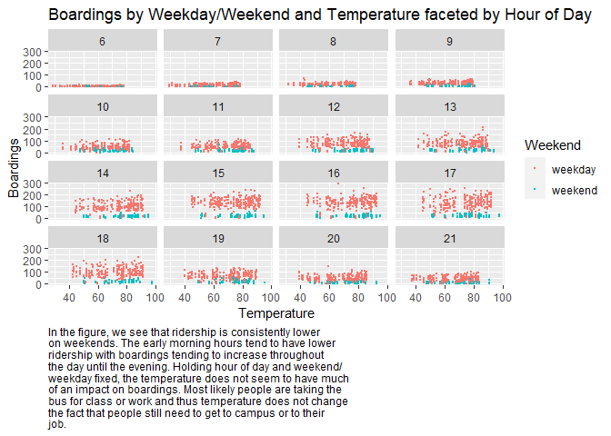

Problem 1
---------

Problem 2
---------

Problem 3
---------

    german_credit <- read.csv("~/School/University of Texas-Austin/Classes/Data Mining/Data/german_credit.csv")

    prob_default = german_credit%>% 
      group_by(history) %>% 
      summarize(prob = mean(Default))

    ggplot(prob_default)+
      geom_col(aes(x=history,y=prob),color='dark green',fill='dark green')+
      theme_minimal()+
      ggtitle("Probability of Default \n by Credit History")+
      ylab("Probability")+
      xlab("History")

    german_split = initial_split(german_credit, prop = 0.8)
    german_train = training(german_split)
    german_test = testing(german_split)

    logit_credit = glm(Default ~ (duration + amount + installment + age + 
                         history + purpose + foreign)^2, data=german_train,
                       family='binomial')

    ## Warning: glm.fit: fitted probabilities numerically 0 or 1 occurred

    # Confusion Matrix
    phat_logit_credit = predict(logit_credit,german_test,
                                type='response')

    ## Warning in predict.lm(object, newdata, se.fit, scale = 1, type = if (type == :
    ## prediction from a rank-deficient fit may be misleading

    yhat_logit_credit = ifelse(phat_logit_credit >0.5 , 1 , 0)
    confusion_logit = table(y = german_test$Default ,
                            yhat = yhat_logit_credit)

Problem 4
---------
