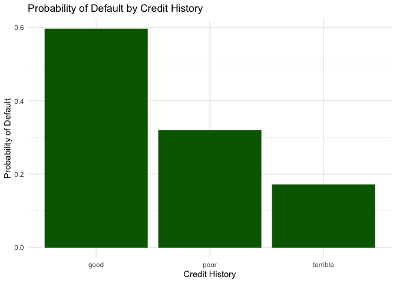

## Problem 1

## Problem 2

## Problem 3

Looking at the bar plot of default probability, we see that the highest
risk of default falls with those who have “good” credit histories. This
is a surprise. We would expect that those with good credit history would
pay back their loans, but this points to the problem with the sampling
method used. By using retrospective sampling, the bank has collected a
sample that overstates the probability of default for those with good
credit. In predicting default with the logit model, exponentiating our
coefficients correspond to odds of defaults, *e**λ*. In
looking at the history variable, “terrible” and “poor” both have about a
-3 coefficient. This implies that having a terrible or poor credit
history decreases the odds of default by about $\\frac{1}{e^\\lambda}$.
This means that good history actually increases the odds of default, an
outcome of the flawed data collection. With the problems in the good
credit history, the data is not adequate for a predictive model of
defaults. Consider two identical people with only credit history
differing, our model would say that the person with good credit history
is more likely to default and thus a riskier loan. Our experience tells
us that this is wrong, we would expect the person with good credit
history to be more likely to pay back their loan. Since our predictive
model would be poor using this retrospective sampling approach, it would
be better to use a random sample of loans. Though we will see a lot of
loans that are not defaulted on, it will be better to have a random
sample of data to create a predictive model. That way, we have a model
that matches our intuition, importantly on the fact that those with good
credit history have a low risk of default.

## Problem 4

We start off by creating a small model which uses market\_segment,
adults, customer\_type, and is\_repeated\_guest as explanatory
variables. We also create a large linear model which includes all
variables in our dataset excluding the arrival date. To generate the
best possible linear model we utilize the lasso model on all variables
and interactions. To measure the out of sample performance of our lasso
model, we use the RMSE. For the small, large and lasso models the RMSE’s
are 0.269292,0.2451936,0.2312441 respectively. We can see that the lasso
model beats the two other models.

