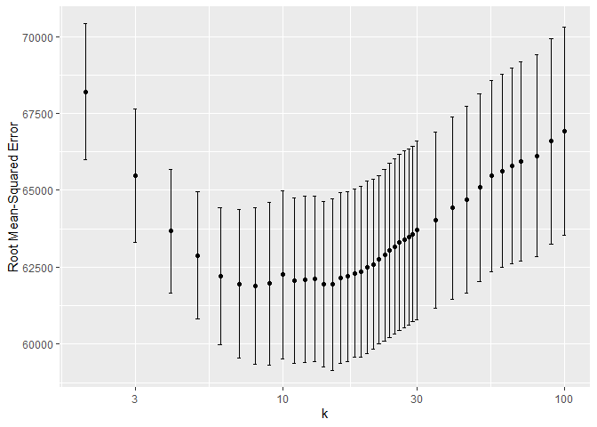
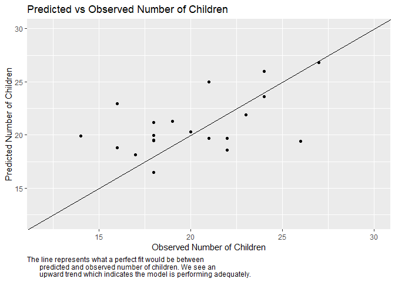

# Homework 2

Patrick Massey, Harrison Snell, Brandon Williams

## Problem 1

## Problem 2

We consider three models for predicting the sale price of a house for
tax authority purposes. In order to assess the predictive power of each,
we conduct a “horse race” to determine who has the best predictive
ability when compared to a withheld testing set of the data by
evaluating root mean squared error (RMSE). In this case, RMSE measures
how far off our predictions are from the actual home price in dollars.
Generally, the lower the RMSE the better. The three models are:

-   Simple linear model (our medium benchmark model)
-   Linear model with additional features and an interaction term
-   K-Nearest Neighbor (KNN) regression

For all three models, we use a train/test split of the data: the
training data set is used to build the model and the testing set is used
to evaluate the model’s performance.1

Consider first the baseline model. This model uses 11 main effects from
the data set in a linear regression. It includes the variables lot size,
age, living area, bedrooms, fireplaces, bathrooms, rooms, heating
method, fuel method, and central air. This model performed consistently
the worst. In this iteration, for example, it achieved an average
out-of-sample mean-squared error of $65949.

This is to be expected. Economic intuition indicates that we are likely
omitting important considerations for house prices, notably land value,
waterfront access and whether or not it is a new construction. We add
these to our linear model to improve it, as well as an interaction term
for lot size and waterfront access.2 Indeed, we see
significant improvement in the RMSE. In this iteration, we see a
mean-squared error of $58267.

Finally, we attempt to create a KNN model. To begin, we include all
possible covariates and attempt to identify the value of K neighbors
that gives us the lowest mean-squared error. The following graph shows
the error on the vertical access and the value of K on the horizontal.

The minimum RMSE3 can be found at k=8 with a RMSE of $61880.
Consistently, across many iterations of train/test splits, the KNN model
had lower mean-squared errors than our baseline medium model but failed
to beat the better linear model. It appears that the data available to
us is better suited to the linear model we identified above. It is
possible the KNN model is over-fitting to the data and therefore
inducing higher RMSEs. We would therefore suggest pursuing a tax policy
that uses the improved linear model we proposed above.

### Footnotes

1 In order to account for random variation in the data
depending on how we split it, we use k-fold cross-validation which takes
k number (in this case, k=10) train/test splits and allows us to examine
the average error over each split. All data is standardized so that KNN
can appropriately measure distance based on standard deviation rather
than the arbitrary units of the covariates.

2 The complete model is `price` regressed on `lotSize`,
`age`, `landValue`, `livingArea`, `bedrooms`, `fireplaces`, `bathrooms`,
`room`, `fuel`, and an interaction term of `waterfront` \* `lotSize`.

3 In order to truly compare lowest RMSE, we opt for choosing
the K that corresponds to the lowest RMSE, instead of choosing the
highest K within one standard error of the minimum (1SE method), which
could be argued for in this context.

## Problem 3

Looking at the bar plot of default probability, we see that the highest
risk of default falls with those who have “good” credit histories. This
is a surprise. We would expect that those with good credit history would
pay back their loans, but this points to the problem with the sampling
method used. By using retrospective sampling, the bank has collected a
sample that overstates the probability of default for those with good
credit. In predicting default with the logit model, exponentiating our
coefficients correspond to odds of defaults, *e**λ*. In
looking at the history variable, “terrible” and “poor” both have about a
-3 coefficient. This implies that having a terrible or poor credit
history decreases the odds of default by about *e*−3. This
means that good history actually increases the odds of default, an
outcome of the flawed data collection. With the problems in the good
credit history, the data is not adequate for a predictive model of
defaults. Consider two identical people with only credit history
differing, our model would say that the person with good credit history
is more likely to default and thus a riskier loan. Our experience tells
us that this is wrong, we would expect the person with good credit
history to be more likely to pay back their loan. Since our predictive
model would be poor using this retrospective sampling approach, it would
be better to use a random sample of loans. Though we will see a lot of
loans that are not defaulted on, it will be better to have a random
sample of data to create a predictive model. That way, we have a model
that matches our intuition, importantly on the fact that those with good
credit history have a low risk of default.

## Problem 4

We start off by creating a small model which uses `market_segment`,
`adults`, `customer_type`, and `is_repeated_guest` as explanatory
variables. We also create a large linear model which includes all
variables in our dataset excluding the arrival date. To generate the
best possible linear model we utilize the lasso model on all variables
and interactions. To measure the out of sample performance of our lasso
model, we use the RMSE. For the small, large and lasso models the RMSE’s
are 0.2765, 0.2484, 0.2335 respectively. We can see that the lasso model
beats the two other models.

