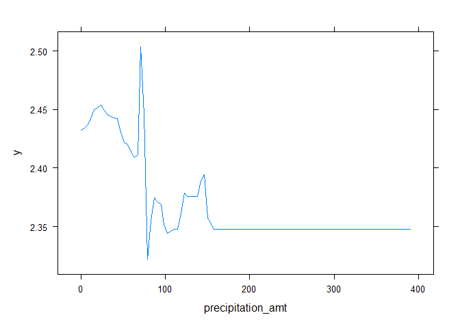
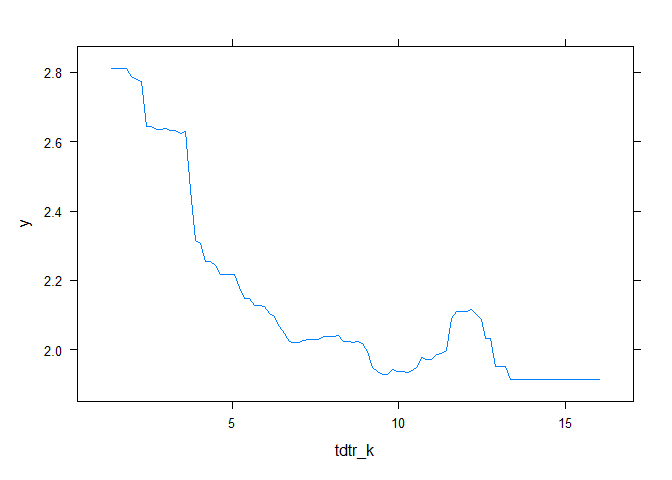

# Homework 3

Patrick Massey, Harrison Snell, Brandon Williams

## Problem 1

1.  The problem with a simple regression of “crime” on “police” is that
    crime is endogenous in police. That is, more crime might directly
    cause more police (a particularly high crime area gets more police,
    instead of the reverse, undermining any element of causality).
    Therefore, we can’t so easily identify the effect of policing on
    crime.
2.  The researchers used a unique element of Washington, DC, where extra
    police are mandated by the national “terror alert” system. On high
    alert days, more police are automatically put on the street.
    Therefore, police presence is not a function of “street” crime and
    is entirely determined exogenously. The results indicate that extra
    police presence as a result of high alert is associated with a
    decrease in crime when police presence is determined by something
    other than the local crime level. This is useful evidence in the
    case for the deterrent effect of police on crime.
3.  Ridership controls for a decrease in crime caused by fewer people
    (fewer tourists on a given day, for example) in the area because
    they are concerned about a high terrorism alert. In other words,
    this provides a check on the hypothesis that the decrease in crime
    is related to the increased police presence, and not a decrease in
    civilian and criminal activity directly related to concerns about
    terrorism itself.
4.  This model appears to be modeling the interaction between the high
    alert variable and the various police districts of DC, while
    controlling for metro ridership. The results indicate that midday
    ridership is associated with an increase in crime, and that high
    alert status in the first police district is associated with a
    decrease in crime. However, this effect seems to lessen or disappear
    in the other districts (not district 1), and the coefficient on the
    interaction variable in any other district is not statistically
    distinguishable from zero. It is likely this was included because it
    allows the researchers to look where police concentration is largest
    (the first district) while holding other confounders constant (such
    as weather, unrelated changes in tourism, etc.) that should effect
    the districts similarly.

## Problem 2

Our model will consider a prediction of log cases of dengue using CART,
random forest, and boosted trees. Our model will consider `city`,
`season`, `precipitation_amt`, `avg_temp_k`, `air_temp_k`,
`dew_point_temp_k`, `max_air_temp_k`,`min_air_temp_k`,
`precip_amt_kg_per_m2`, `relative_humidity_percent`,
`specific_humidity`, and `tdtr_k` as features.

Let’s begin by taking a look at our CART.

We are already starting to lose some interpretability. What if we use
the 1SE rule to prune the tree back?

Much more parsimonious. Our first split comes from Average Diurnal
Temperature Range (DTR), and then our splits come from season and
specific humidity.

Let’s consider a random forest instead. Here you can see MSE as a
function of the number of trees used in the random forest. It levels out
before reaching 100 trees, so we aren’t gaining that much after that.

Let’s compare RMSEs to see how we are doing. The pruned tree has an RMSE
of 0.9372846, while the random forest has an RMSE of 0.8774907, a marked
improvement (recall that our predictions are in log form).

What about variable importance? Is there anything that could be ignored
from the random forest without noticeable improvement?

Precipitation amount has the lowest variable importance, probably
because it is partially captured by precipitation per square meter, but
it is also not irrelevant.

Finally, let’s consider a gradient boosted tree. To compare different
the different tuning parameters, we create a for-loop that runs through
a number of interaction depth, shrinkage, and number of tree variables.
Seeing the lowest RMSE value allows us to set the parameters as optimal.

    hyper_grid %>%
      dplyr::arrange(min_RMSE) %>%
      head(10)

This gives us a good indication of where to tune our parameters. Let’s
set the shrinkage to .01 and the interaction depth to 4. Trees will be
set to 500 since it converged around the mid-400s.

Comparing RMSEs, the random forest does just slightly better than the
boosted model.

<table>
<thead>
<tr class="header">
<th>Model</th>
<th>RMSE</th>
</tr>
</thead>
<tbody>
<tr class="odd">
<td>CART</td>
<td>0.920833</td>
</tr>
<tr class="even">
<td>Forest</td>
<td>0.8774907</td>
</tr>
<tr class="odd">
<td>Boosted</td>
<td>0.8753748</td>
</tr>
</tbody>
</table>

Let’s look at partial dependence plots from the boosted tree. We include
`specific_humidity` and `precipitation_amt`, as well as `tdtr_k` since
it played an important role in the first tree we looked at.

##Green Certification

Before developing any models we first begin by performing some feature
engineering. The first feature we engineer is the outcome variable of
interest revenue which represents the revenue per square foot per
calendar year. In order to create this feature we first scale down
leasing\_rate to a percentage by dividing by 100, and then multiplying
that by the rent. We also create a new feature called utility\_cost
which is the sum of gas and electricity costs for rents that are quoted
on a net contract basis. The purpose of this new feature is to capture
the costs associated with a rental offered on a net contract basis. We
then create a training set and a testing set with a split of 80/20. This
gives us 6315 observations in our training set and 1579 observations in
our testing set.

To begin developing our model we start with a linear model using all
features of the data set excluding, CS\_PropertyID, cluster,
leasing\_rate, Rent, LEED, and Energystar. We remove CS\_PropertyID as
it is just a unique building ID, and for similar reasons we remove
cluster. We remove leasing\_rate and Rent since these variables directly
calculate our outcome variable. Lastly we remove LEED and Energystar
because we are only concerned if a building is green certified or not,
and not what kind of green certification a building may have. We capture
this with the green\_rating feature.

After getting a baseline model we then moved onto predicting using a
tree model. The initial tree model generated, shown below, was extremely
complex and not readable. This indicated that there might be some
overfitting happening.

We then pruned our tree using the 1se method which generated the much
simpler decision tree shown below. This tree sacrifices a marginal
amount of performance for a much simpler tree.

The visualization of the tree really highlighted the interactions that
were not included in our baseline linear model. Naturally after seeing
the performance of the tree as compared to the linear model we wanted to
see if it could be improved upon using a random forest.

We see that our error really starts to bottom out around 100 trees. The
performance of our models is shown below.

<table>
<thead>
<tr class="header">
<th style="text-align: left;">Model</th>
<th style="text-align: right;">RMSE</th>
</tr>
</thead>
<tbody>
<tr class="odd">
<td style="text-align: left;">Linear</td>
<td style="text-align: right;">9.601229</td>
</tr>
<tr class="even">
<td style="text-align: left;">CART</td>
<td style="text-align: right;">8.861500</td>
</tr>
<tr class="odd">
<td style="text-align: left;">Pruned Tree</td>
<td style="text-align: right;">9.312698</td>
</tr>
<tr class="even">
<td style="text-align: left;">Random Forest</td>
<td style="text-align: right;">6.869059</td>
</tr>
</tbody>
</table>

The random forest provides a significant reduction in RMSE as compared
to our baseline linear model.

Now that we have developed a model for predicting the revenue generated
from an building we will look at the importance of the variables we have
used in our model.

We can see that from a prediction point of view the green rating of a
building does provide a large (>10%) increase in RMSE performance. Now
lets look at the dollar increase in revenue from a building that has a
green rating by creating a partial dependence plot shown below.

From the plot we can see that there is a small marginal improvement in
the expected revenue for a green building versus a non-green building.
In fact going from a non-green building to a green building will give a
revenue increase of 0.7526676 which in percentage terms leads to a
3.117% increase in revenue. This is not a large increase in revenue for
transitioning to a green certified building but it is large enough that
it should be considered when making the decision.

## California Housing

The goal of this problem is to build the best possible model for
predicting the median house value. We start by building the best
possible linear, KNN, CART, Random Forest, and Boosted models. After the
initial train-test split, we use just the training data to again split
for each models building and optimization process.

The first step for each model is to make a new train-test split from our
global train-test split. Then use these new sets to build and test
iterations of different models.

We can see that the best model from each category has an out-of-sample
error based on their own train-test splits. For example, we have an
average RMSE from the linear model of `linear_errs` or an average RMSE
of `boost_errs` from the boosted model. However, these RMSE’s are from
train-test splits built from the original train-test split. In order to
compare RMSE’s across model categories, we return to our first
train-test split to recover RMSE’s and determine the best predictive
model.

Comparing out-of-sample errors across models, we see that the boosting
model and the random forest perform quite similarly, with RMSE’s of
`boost_rmse` and `forest_rmse` respectively. This is compared to
something like the linear model which yields `linear_rmse` and we see
that both the boosting and random forets are considerable improvements.
The CART and KNN models fall somewhere in between and we include their
RMSE values for completness, CART has an RMSE of `cart_rmse` and KNN
yields `knn_rmse`. Finally, we will move forward with the boosting as
the best predictive model and create our plots.

