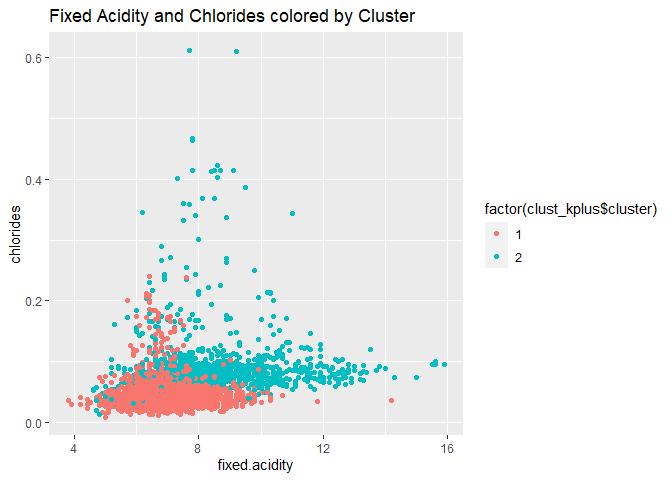
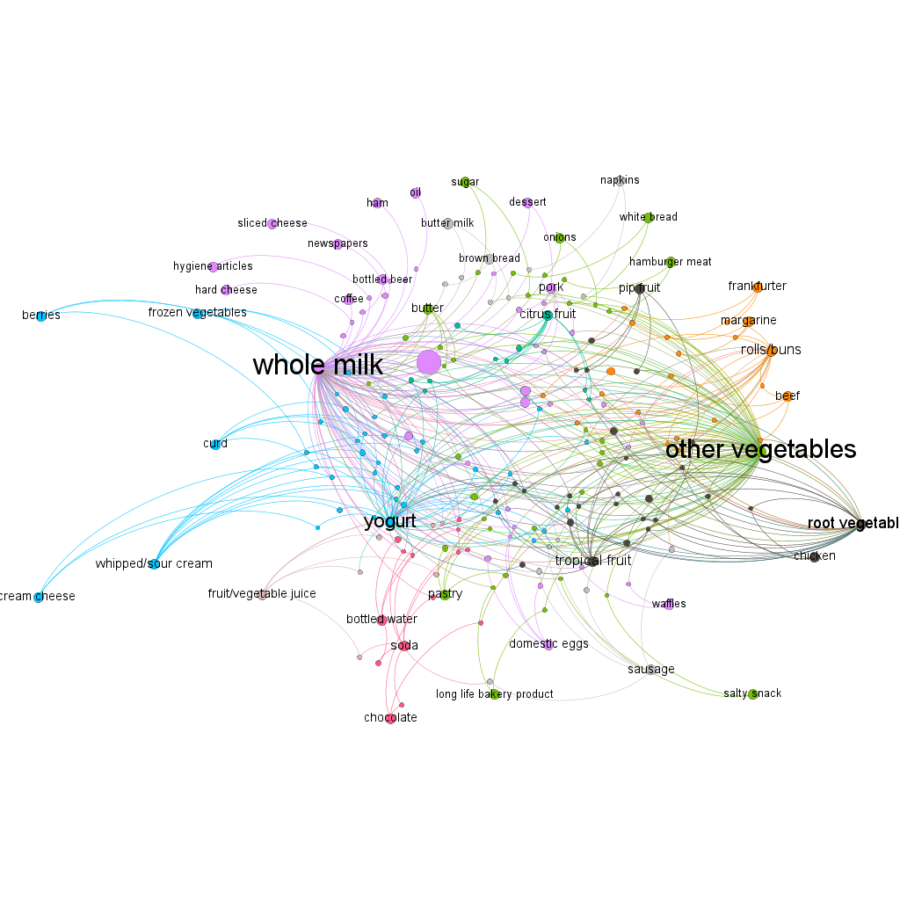

Homework 4
==========

Patrick Massey, Harrison Snell, Brandon Williams

Problem 1 - Wine Clustering and PCA
-----------------------------------

In this problem, we want to use a clustering approach and a PCA approach
to use the chemical properties of wine to determine the color of the
wine. We will start by running K-means++ as our clustering algorithm
with 2 clusters. We ran clustering with more than 2 clusters to see if
any larger trends emerged. Specifically, in the realm of quality,
however clustering was not able to capture any useful divisions of
quality given the chemical properties of the wine. The same goes for PCA
with none of the principal components picking up on the quality of the
wine. This is not a surprise as it is well known that even wine experts
tend to not be able to accurately judge the quality of a wine. For PCA,
we choose to run the analysis with rank 6 to capture a large amount of
the variability. In both cases, the chemical properties of the wine were
scaled and centered.

Clustering gets about 97.4% of wines correctly identified by their
color. When we compare a few charts of the chemical properties colored
by either the true color of the wine or the clustering results, we see
that the graphs are very similar.

As we can see from the visualization, the clustering algorithm picks up
well on the color of the wines. We can now look at the PCA approach.

After running PCA with rank 6, we see that we capture about 85% of the
variation. PC1, with the highest proportion of that variance, is the
component that best captures the color classification of the wines. In
the first pair of graphs comparing color to a couple principle
components, we see that the color of the wine is almost
indistinguishable in the case of PC2. For a given value of PC2, it is
unlikely that we would be able to tell the color. For PC1, that is a
good bit of difference between the reds and the whites. This means that
given a value for PC1, we are able to make a good guess as to the color
of the wine. The next sets of graphs show that using PC1 and at least
one other component can result in a good predictions of wine color. If
we were to run a simple supervised learning algorithm with all our
principle components, it would likely do a very good job identifying the
color of wines given their PCA weightings. Again, we see that PC1
appears to be doing most of the heavy lifting. When we look at the graph
with PC2 and PC4, we see the general result of two non-PC1 components
that is a blob of points that all look the same. The fact that a single
principle component seems to be providing most of the color
identification lends itself to the idea that clustering is a better
approach for this problem. The clustering approach is more intuitive for
separating wines by their color given chemical features. Of course,
running supervised learning on the principle components could also end
with very accurate results, we start to run into the problem of actually
reducing dimensions. Running a supervised learning algorithm with 6
components does not reduce the dimension much with our 11 chemical
properties. Given that the clustering algorithm is about 94% accurate
and remains the more simple and intuitive approach to separating wines
into the 2 groups of color, we believe that clustering is the best
unsupervised approach to this question.

Problem 2 - NutrientH2O
-----------------------

When considering marketing to the NutrientH2O Twitter followers, there
are several natural groups that emerge using unsupervised learning
techniques. These groups will help NutrientH20 coordinate a marketing
campaign to specific follower demographics. Before conducting principle
component analysis (PCA), let’s take a look at the overall trends of the
tweets of the Twitter followers.

As we might have predicted, the average user generally tweets about
general, uncategorized “chatter” and some photo sharing. Nevertheless,
we see some high counts in health and nutrition, cooking, politics,
sports, and travel. Are there natural groupings of followers into
categories? Consider the correlation matrix of tweet type organized by
hierarchical clustering:

Some patterns emerge. Disregarding the spam/adult categories (unless
NutrientH2O is considering a significant rebrand), there are clear
groupings around: \* beauty, cooking, and fashion \* health, nutrition,
and fitness \* family, school, religion, and parenting \* gaming,
sports, and university

Since clustering is naturally mutually exclusive and Twitter users can
have multiple interests simultaneously, we choose to present a PCA on
the follower base to see if these categorical patterns continue to
emerge based on the components of the Tweets. An initial PCA reveals how
much variance is explained by each principle component. We see the
variance dropping off after 5 components, and certainly after 10 we are
gaining smaller and smaller amounts of variance.

Running a PCA with 10 principle components gives us some pretty clear
group characteristics. Let’s look at the loadings for some of the
components. The first principle component is once again the adult/spam
group, so let’s look at the high loadings for PC2. We can call this the
“influencer” group: high in cooking, fashion, shopping, and beauty.
Considering the overall popularity of these types of tweets among
NutrientH2O followers, this would be an effective demographic to market
to.

    ##           tweet       PC2
    ## 1       cooking 0.3142880
    ## 2 photo_sharing 0.3030776
    ## 3       fashion 0.2797997
    ## 4      shopping 0.2098528
    ## 5        beauty 0.2086099
    ## 6       chatter 0.1972255

PC3 represents the wellness demographic–people interested in health,
nutrition, personal fitness, and cooking. Given NutrientH2O’s brand
name, this is a natural group to target in any social media marketing.

    ##              tweet       PC3
    ## 1 health_nutrition 0.2255148
    ## 2 personal_fitness 0.2173747
    ## 3          cooking 0.1944997
    ## 4           beauty 0.1507105
    ## 5         outdoors 0.1403903
    ## 6          fashion 0.1387695

Finally, PC4 shows a younger demographic, those interested in video
games, sports, and college/university. The insight here for the brand is
to target this market segment with branding aimed at youth and
college-aged consumers.

    ##            tweet       PC4
    ## 1    college_uni 0.2555873
    ## 2  online_gaming 0.2207630
    ## 3 sports_playing 0.1756699
    ## 4  photo_sharing 0.1514910
    ## 5         beauty 0.1469076
    ## 6        fashion 0.1379828

The other principle components begin to show less clear market segments,
but some interesting ones still emerge. Consider PC7, which has high
loadings in art, film, and crafts, or PC10, which seems to have a high
interest in dating.

    ##                    PC1   PC2   PC3   PC4   PC5   PC6   PC7   PC8   PC9  PC10
    ## chatter          -0.13  0.20 -0.07  0.11 -0.19  0.46 -0.11  0.07 -0.02  0.11
    ## current_events   -0.10  0.06 -0.05  0.03 -0.06  0.14  0.04 -0.05 -0.02 -0.11
    ## travel           -0.12  0.04 -0.42 -0.15 -0.01 -0.16  0.09  0.31  0.02 -0.11
    ## photo_sharing    -0.18  0.30  0.01  0.15 -0.23  0.21 -0.13  0.02  0.02 -0.13
    ## uncategorized    -0.09  0.15  0.03  0.02  0.06 -0.04  0.19 -0.05 -0.05  0.27
    ## tv_film          -0.10  0.08 -0.09  0.09  0.21  0.06  0.50 -0.22  0.13 -0.10
    ## sports_fandom    -0.29 -0.32  0.05  0.06 -0.03  0.01 -0.07 -0.11  0.02 -0.03
    ## politics         -0.13  0.01 -0.49 -0.20 -0.06 -0.13 -0.07  0.01  0.03 -0.04
    ## food             -0.30 -0.24  0.11 -0.07  0.07  0.02  0.04  0.09  0.05 -0.10
    ## family           -0.24 -0.20  0.05  0.07 -0.01  0.05 -0.10 -0.02  0.00 -0.10
    ## home_and_garden  -0.12  0.05 -0.02 -0.01  0.04  0.04  0.09 -0.10 -0.08  0.27
    ## music            -0.12  0.14  0.01  0.08  0.07 -0.01  0.15 -0.09  0.07 -0.18
    ## news             -0.13 -0.04 -0.34 -0.18 -0.03 -0.09 -0.14 -0.46  0.01  0.08
    ## online_gaming    -0.07  0.08 -0.06  0.22  0.48 -0.01 -0.29  0.06 -0.04 -0.01
    ## shopping         -0.13  0.21 -0.05  0.10 -0.20  0.43 -0.09  0.03  0.05 -0.13
    ## health_nutrition -0.12  0.15  0.23 -0.46  0.17  0.08 -0.04  0.04  0.06 -0.03
    ## college_uni      -0.09  0.12 -0.09  0.26  0.49  0.00 -0.19  0.04 -0.01 -0.04
    ## sports_playing   -0.13  0.11 -0.04  0.18  0.37 -0.03 -0.22  0.06  0.01  0.07
    ## cooking          -0.19  0.31  0.19  0.01 -0.12 -0.36 -0.06 -0.05  0.00 -0.11
    ## eco              -0.15  0.09  0.03 -0.12  0.02  0.18  0.00  0.04 -0.08 -0.11
    ## computers        -0.14  0.04 -0.37 -0.14 -0.06 -0.14 -0.01  0.36 -0.01 -0.10
    ## business         -0.14  0.10 -0.11  0.01 -0.05  0.07  0.09  0.14  0.11  0.07
    ## outdoors         -0.14  0.11  0.14 -0.41  0.15  0.04 -0.06 -0.08 -0.03  0.02
    ## crafts           -0.19 -0.02  0.00  0.02  0.04  0.08  0.24  0.03  0.03  0.04
    ## automotive       -0.13 -0.03 -0.19 -0.04 -0.06  0.06 -0.24 -0.59 -0.06  0.08
    ## art              -0.10  0.06 -0.05  0.06  0.16  0.03  0.49 -0.16  0.05 -0.04
    ## religion         -0.30 -0.32  0.09  0.07 -0.02 -0.03  0.02  0.10  0.03 -0.07
    ## beauty           -0.20  0.21  0.15  0.15 -0.19 -0.37 -0.02 -0.06 -0.02 -0.04
    ## parenting        -0.29 -0.30  0.09  0.05 -0.04 -0.01 -0.04  0.06 -0.01 -0.04
    ## dating           -0.11  0.07 -0.03 -0.03 -0.01  0.00  0.03  0.17 -0.05  0.76
    ## school           -0.28 -0.20  0.08  0.09 -0.09  0.01  0.02  0.08 -0.03  0.25
    ## personal_fitness -0.14  0.14  0.22 -0.44  0.16  0.09 -0.04  0.04  0.04 -0.03
    ## fashion          -0.18  0.28  0.14  0.14 -0.17 -0.36 -0.03 -0.02 -0.02  0.04
    ## small_business   -0.12  0.09 -0.10  0.08  0.03  0.05  0.21  0.01 -0.12  0.00
    ## spam             -0.01  0.00 -0.01 -0.02  0.02  0.01  0.07  0.01 -0.66 -0.12
    ## adult            -0.03 -0.01  0.00 -0.02  0.01  0.02  0.07  0.00 -0.69 -0.06

Principle component analysis reveals some clear “ingredients” for each
demographic, highlighting their interests, and giving valuable insight
to the NutrientH2O marketing team to orient their strategy.

Problem 3 - Market Basket
-------------------------

Analyzing a grocery purchases is an extremely important task for grocery
retailers. Understanding how products connect to certain consumers can
allow the retailer to create product placement that a consumer will find
useful. This creates a better experience for the consumer and helps
increase sales and thus driving revenue up for the retailer. In this
example we start with a data set that contains 9,835 consumer grocery
baskets. The support level parameter essentially indicates the
popularity of an item. When deciding the parameters we picked a support
level of .001. The reasoning being that we wanted items to have appeared
in approximately 10 consumers grocery carts. The confidence level is
essentially the conditional probability of item x being purchased given
the consumer has purchased item y. We set this level for at .05 to
indicate that we wanted at least a 5% probability of a consumer
purchasing one item conditional on them already purchasing another. When
using these levels to create association rules we are left with 36,014
association rules. This is too many rules to make a sensible graph out
of but lets look at some key plots first.

In this figure we see that our rules with length four have a large
variance in confidence but low support. As we shorten the rule length,
there we see less variance in confidence and a higher level of support.
Again our current number of rules is too much to make a sensible graph.
In order to construct a graph we will subset the rules looking for a
confidence greater than 25% and support greater than 1%. This leaves us
with 171 rules, now lets visualize these rules with a graph.

This graph produces some results that are both interesting and seem
reasonable. The colors on the graph represent the modularity class, the
size of the nodes represents the support, and the size of the text
represents the degree. We see two main groups of consumers, those who
purchase whole milk and those who purchase “other vegetable”. We see a
slightly smaller group of consumers purchasing yogurt and root
vegetables as well.
