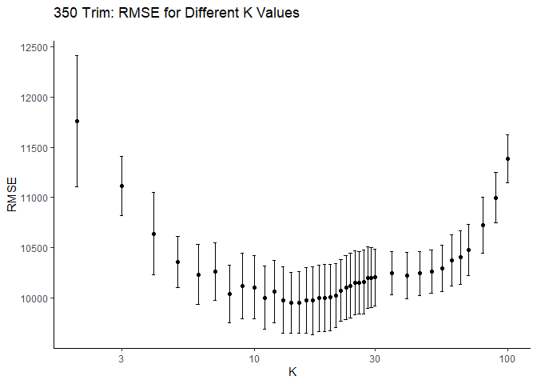
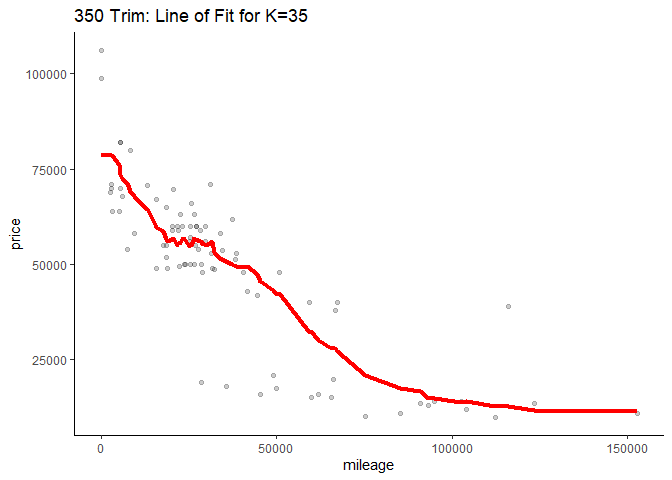
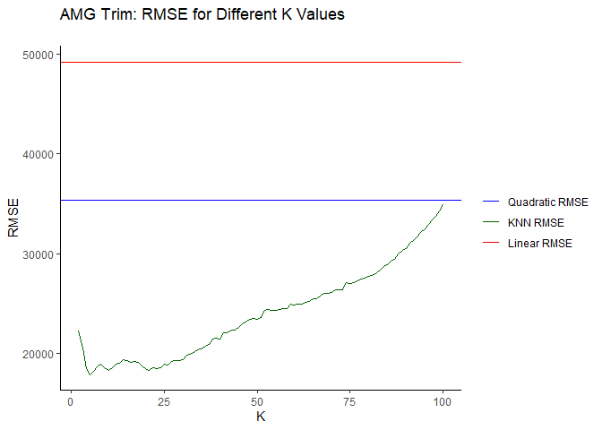
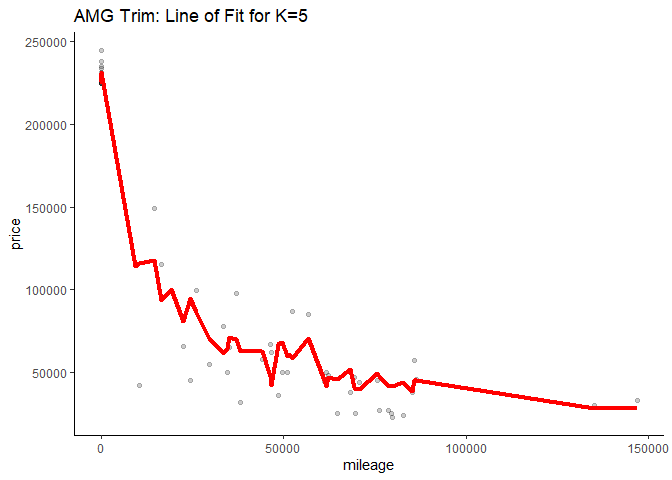

Problem 4
---------

In this problem, we want to find the optimal value of K in our KNN
regressions for each trim. In the chart of RMSE versus K for each trim,
there is a line for the RMSE of a linear benchmark, as well as a
quadratic benchmark.

From the 350 Trim chart of RMSE versus K, we see that the RMSE bottoms
out at 10, as such the line of fit against the test data is for that K
value. Similarly we have a minimal RMSE and line of fit for k=5.
