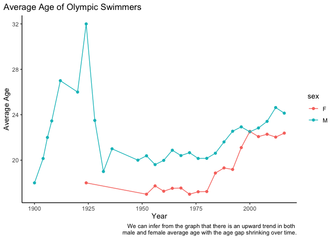

\#\#Problem 2

\#a

<table>
<caption>Top 10 Billbord Performers</caption>
<thead>
<tr class="header">
<th style="text-align: left;">performer</th>
<th style="text-align: left;">song</th>
<th style="text-align: right;">count</th>
</tr>
</thead>
<tbody>
<tr class="odd">
<td style="text-align: left;">Imagine Dragons</td>
<td style="text-align: left;">Radioactive</td>
<td style="text-align: right;">87</td>
</tr>
<tr class="even">
<td style="text-align: left;">AWOLNATION</td>
<td style="text-align: left;">Sail</td>
<td style="text-align: right;">79</td>
</tr>
<tr class="odd">
<td style="text-align: left;">Jason Mraz</td>
<td style="text-align: left;">I’m Yours</td>
<td style="text-align: right;">76</td>
</tr>
<tr class="even">
<td style="text-align: left;">The Weeknd</td>
<td style="text-align: left;">Blinding Lights</td>
<td style="text-align: right;">76</td>
</tr>
<tr class="odd">
<td style="text-align: left;">LeAnn Rimes</td>
<td style="text-align: left;">How Do I Live</td>
<td style="text-align: right;">69</td>
</tr>
<tr class="even">
<td style="text-align: left;">LMFAO Featuring Lauren Bennett &amp; GoonRock</td>
<td style="text-align: left;">Party Rock Anthem</td>
<td style="text-align: right;">68</td>
</tr>
<tr class="odd">
<td style="text-align: left;">OneRepublic</td>
<td style="text-align: left;">Counting Stars</td>
<td style="text-align: right;">68</td>
</tr>
<tr class="even">
<td style="text-align: left;">Adele</td>
<td style="text-align: left;">Rolling In The Deep</td>
<td style="text-align: right;">65</td>
</tr>
<tr class="odd">
<td style="text-align: left;">Jewel</td>
<td style="text-align: left;">Foolish Games/You Were Meant For Me</td>
<td style="text-align: right;">65</td>
</tr>
<tr class="even">
<td style="text-align: left;">Carrie Underwood</td>
<td style="text-align: left;">Before He Cheats</td>
<td style="text-align: right;">64</td>
</tr>
</tbody>
</table>

Top 10 Billbord Performers

\#b  \#c
 \#\#Problem
3 \#a

The 95th percentile of height for female competitors in the Athletics
events is: 183 \#b

The event with the highest standard deviation is: Rowing Women’s Coxed
Fours which had a standard deviation of 10.87. \#c
 Prior to
the 1952 Olympic Games, there appears to be a small number of
participants for each year which is causing the large swings early on.
After 1952 the amount of participating athletes becomes larger and
stabilizes the mean of the age of the participants.
